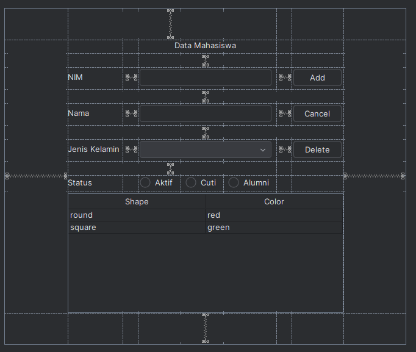

# Janji
Saya Putra Hadiyanto Nugroho dengan NIM 2308163 mengerjakan Tugas Praktikum 5 dalam mata kuliah Desain dan Pemrograman Berorientasi Objek untuk keberkahanNya maka saya tidak melakukan kecurangan seperti yang telah dispesifikasikan. Aamiin.

# Desain Program
Program ini berfungsi untuk CRUD (Create, Read, Update, dan Delete) untuk data Mahasiswa. Data mahasiswa ini disimpan dalam database berbasis MySQL.

Program ini menggunakan 2 library, yaitu :
- Java Swing GUI
- JDBC (Koneksi Database MySQL di Java)
 
## Desain GUI Swing

    

## Fungsi Utama     
Program ini memiliki beberapa fitur, yaitu sebagai berikut :
### 1. Menampilkan Data (Read)
Data mahasiswa ditampilkan dalam sebuah tabel yang berisi NIM, Nama, Jenis Kelamin, dan Status Mahasiswa.
### 2. Menambahkan Data (Create)
User dapat menambahkan data mahasiswa dengan mengisi Form di tampilan utama kemudian menekan tombol Add.
### 3. Mengedit Data (Update)
User dapat mengedit data mahasiswa yang sudah ada dengan mengklik data yang mau diedit di tabel, kemudian edit isi form sesuai dengan data yang ingin diedit, kemudian klik Edit.
### 4. Menghapus Data (Delete)
User dapat menghapus data mahasiswa yang sudah ada dengan mengklik data yang mau dihapus di tabel, kemudian klik tombol Delete, dan lakukan konfirmasi di pop-up screen jika yakin ingin menghapus data tersebut.

## Desain Class
### 1. Class Mahasiswa
Class ini berisi atribut data mahasiswa, yaitu `nim`, `nama`, `jenisKelamin`, dan `statusMahasiswa`. Untuk method ada getter dan setter untuk setiap atribut.
### 2. Class Menu extends JFrame
Class ini berisi Graphical User Interface (GUI) dari program, berfungsi untuk mengatur GUI, serta method untuk insert, update, dan delete.
### 3. Database 
Class ini berisi koneksi dan aturan Java ke MySQL. Terdapat method untuk menjalakan query `select`, dan `insertUpdateDeletequery`.

# Alur Program
### 1. Tampilan Awal
Pada tampilan awal, dibuat objek `Menu`, kemudian ditampilkan window dengan ukuran 480 x 540 pixel. Di dalam konstruktor `Menu`, dibuatlah koneksi dengan database MySQL dan aturan-aturan untuk setiap tombol, tabel, dan tampilan.
### 2. Menambahkan data
User mengisi data `nim`, `nama`, `jenisKelamin`, dan `statusMahasiswa` di form tampilan utama, kemudian mengklik tombol Add. Tombol Add akan memanggil method `insertData()` yang melakukan : 
- Mengambil data dari input form.
- Menambahkan data ke database.
- Memperbarui tabel dengan method `setTable()`
- Mengosongkan form dengan method `clearTable()`
- Menampilkan pop-up sukses.
### 3. Mengupdate Data
User memilih data yang mau diedit di dalam table, kemudian mengganti isi form sesuai dengan data yang mau diupdate, lalu mengklik tombol Update yang memanggil method `updateData()` yang melakukan : 
- Mengambil data dari input form.
- Memperbarui data di database berdasarkan data yang diambil.
- Memperbarui tabel dengan method `setTable()`
- Mengosongkan form dengan method `clearForm()`
- Menampilkan pop-up sukses.
### 4. Menghapus Data
User memilih data yang mau dihapus di dalam table, kemudian menekan tombol Delete yang memanggil method `deleteData()` yang melakukan : 
- Menampilkan pop-up konfirmasi apabila data mau dihapus atau tidak, jika iya maka lanjut, jika tidak maka berhenti.
- Mengambil data nim dari input form.
- Menghapus data di database berdasarkan nim yang diambil tadi.
- Memperbarui tabel dengan method `setTable()`
- Mengosongkan form dengan method `clearForm()`
- Menampilkan pop-up sukses.
### 5. Memlih data dan Cancel Data
User dapat memilih salah satu data yang ada di tabel, maka akan mentrigger `mouseListener`, yang akan :
- Mengamnbil data untuk index tersebut.
- Mengupdate isi form supaya berisi data yang diambil.
- Tombol Add akan berubah menjadi Update.
- Muncul tombol Delete, dan Cancel.
- Apabila Cancel dipanggil, maka akan membersihkan form dengan memanggil method `clearForm()`

# Dokumentasi

